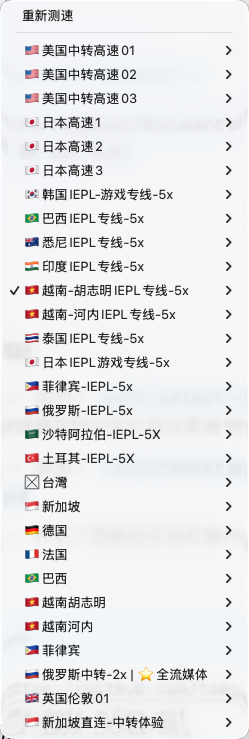

# ClashFX 配置修改工具

用于自动修改 ClashFX 配置文件，生成过滤高速节点的自动选择策略组。

> **开发规范**：本项目遵循 [vibe_rules](https://github.com/tangxuan/vibe-rules) 开发实践。

## 效果展示

### 非高速节点策略组


### 海外节点策略组


## 功能

1. **备份配置文件** - 自动备份到 `backups/` 目录
2. **解析代理节点** - 从 `proxies` 段落提取所有节点名称
3. **过滤无效节点** - 排除以下无效节点：
   - 剩余流量提示（如「剩余流量：457.68 GB」）
   - 时间提示（如「距离下次重置剩余：21 天」）
   - 套餐到期提示（如「套餐到期：2027-09-08」）
   - 线路更新提示（如「⚠️线路持续更新，请更新订阅！」）
   - 企业套餐提示（如「⚡️⚡️企业套餐可使用IPLC企业专线！」）
4. **过滤高速节点** - 排除所有 `-5x` 及以上倍数的节点（如 `-5x`, `-10x`, `-15x`）
5. **生成策略组** - 创建三个 `type: url-test` 的自动选择策略组：
   - `auto-select-no-high-speed`：排除 >=5x 高速节点
   - `auto-select-overseas`：排除中国大陆及香港节点（包含🇨🇳、中国、内地、大陆、国内、CN、香港、深港），保留所有海外节点（包含高速节点）
   - `auto-select-gemini`：排除中国大陆、香港及越南节点（包含🇻🇳、越南、河内、胡志明），用于 Gemini 访问
6. **插入策略组** - 新策略组插入到 `proxy-groups` 区域
7. **关联策略组** - 将新策略组添加到 `type: select` 的策略组中，位于「自动选择」之前
8. **HTTP 共享** - 可选功能，通过 8080 端口 HTTP 共享配置目录，供手机等客户端下载

## 使用方法

### 配置

修改脚本顶部的配置区域：

```python
# ============ 手动配置区域 ============
# 配置文件路径
CONFIG_PATH = Path("/Users/tangxuan/.config/clashfx/jgjs.yaml")
# 非高速自动选择策略组名称
NO_HIGH_SPEED_GROUP_NAME = "auto-select-no-high-speed"
# 海外节点自动选择策略组名称
OVERSEAS_GROUP_NAME = "auto-select-overseas"
# Gemini 访问策略组名称（排除越南节点）
GEMINI_GROUP_NAME = "auto-select-gemini"
# HTTP 共享开关（启用后会在 8080 端口共享配置目录，供手机等客户端下载）
ENABLE_HTTP_SHARE = False
# ====================================
```

### 运行

```bash
python3 jgjs_rules_modify.py
```

## 项目结构

```
jgjs-rules-modify/
├── jgjs_rules_modify.py    # 主脚本
├── README.md               # 项目文档
├── requirements/           # 需求文档目录
│   ├── http-share.md      # HTTP 共享功能需求
│   ├── overseas-group.md  # 海外节点策略组需求
│   └── gemini-group.md    # Gemini 策略组需求
├── backups/                # 备份目录（自动生成）
│   └── jgjs_backup_*.yaml
└── tests/                  # 测试目录
    └── jgjs.yaml           # 测试配置文件
```

## 约束

- **备份位置**：备份文件保存在项目目录下的 `backups/` 文件夹中
- **策略组名称**：默认名称为 `auto-select-no-high-speed`、`auto-select-overseas` 和 `auto-select-gemini`，可在配置区域修改
- **海外节点定义**：排除包含🇨🇳、中国、内地、大陆、国内、CN、香港、深港等关键词的节点
- **Gemini 节点定义**：在海外节点基础上，额外排除越南节点（🇻🇳、越南、河内、胡志明）

## 测试

测试文件位于 `tests/jgjs.yaml`，运行前会自动从原始配置复制。测试步骤：

1. 修改 `CONFIG_PATH` 指向测试文件
2. 运行脚本验证逻辑正确性
3. 查看 `tests/jgjs.yaml` 确认策略组已正确生成和插入

## 注意事项

- 运行前请确保 ClashFX 已关闭，否则配置文件可能被覆盖
- 每次运行都会生成新的备份文件，建议定期清理 `backups/` 目录
- 如果配置文件格式有变化，可能需要调整解析逻辑
